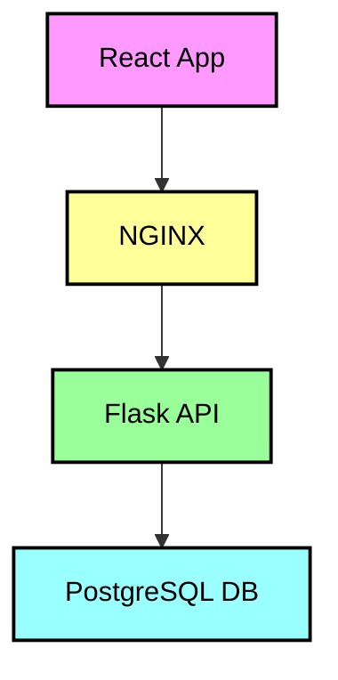

# K8sPortfolio

## Table of Contents
1.  [Introduction](#introduction)
2.  [Features](#features)
3.  [Technologies Used](#technologies-used)
4.  [Architecture](#architecture)
5.  [Getting Started](#getting-started)
    1.  [Prerequisites](#prerequisites)
    2.  [Clone the Repository](#clone-the-repository)
    3.  [Build and Run with Docker Compose](#build-and-run-with-docker-compose)
6.  [Kubernetes Deployment](#kubernetes-deployment)
    1.  [Configuration](#configuration)
    2.  [Deploying the Application](#deploying-the-application)
    3.  [Verification](#verification)
7. [Usage](#usage)
    1.  [Accessing the Application](#accessing-the-application)
    2.  [Key Functionalities](#key-functionalities)
    3.  [Example API Endpoints](#example-api-endpoints)
8.  [Contributing](#contributing)
9.  [Contact](#contact)

## Introduction

Welcome to the **K8sPortfolio** project! This repository hosts a portfolio application built with React, Flask, and NGINX, deployed using Docker Compose. The primary goal of this project was to challenge myself by learning and working with technologies that were entirely new to me, such as Docker, NGINX, Kubernetes, PostgreSQL, React, and Flask.

With prior experience in Laravel, PHP, Java and MySQL, this project pushed me to explore modern tools for building, deploying, and managing full-stack applications in containerized environments. Through this learning journey, I achieved several key milestones:

-   **Full-Stack Development with Unfamiliar Technologies**: I built a full-stack application using a tech stack I had no prior experience with. This involved working with React for the frontend, Flask for the backend, PostgreSQL for the database, and NGINX as a reverse proxy.
    
-   **Docker and Image Management**: I successfully developed the application to run in a Docker container, and the images are available on Docker Hub. When users run `docker-compose up --build`, they can rebuild the image locally. Alternatively, I’ve provided commented-out code to pull pre-built images from Docker Hub, ensuring flexibility in deployment.
    
-   **NGINX Port Forwarding**: During this project, I learned to configure NGINX for reverse proxying and port forwarding, ensuring smooth routing between the frontend and backend services.
    
-   **Kubernetes-Ready Architecture**: While I haven’t included the Kubernetes deployment YAML files in this repository yet, the application architecture is Kubernetes-ready. This means that deploying the app to Kubernetes won’t require significant changes, making it versatile for different deployment environments.
    

Through this project, I gained valuable insights into modern software development practices, containerization, and the orchestration of multi-service applications. This repository is not just a showcase of technical skills, but a testament to my ability to quickly learn new tools, adapt to unfamiliar environments, and apply them in real-world scenarios.

## Features

- **Curated Repository List**: Displays a list of curated repositories stored in a PostgreSQL database, allowing users to browse and view projects.
  
- **CRUD Operations**: Users can create, read, update, and delete curated repository entries through a user-friendly dashboard.
  
- **User Authentication**: A simple authentication system allows users to register (currently limited to one user), log in, and manage their sessions. The system includes password recovery functionality.
  
- **Dashboard Interface**: After logging in, users are redirected to a dashboard that lists all curated repositories, providing easy access for management tasks.
  
- **Static Page**: The current version features a responsive static page designed to present repository information clearly and efficiently.
  
- **Password Recovery**: Users can set a new password using a simple input box, without any authentication check. This is designed for the single-user setup, where only one user is required.
  
- **Dockerized Setup**: The application runs inside Docker containers, providing consistency across development and production environments.
  
- **NGINX Reverse Proxy**: NGINX is configured to handle requests, ensuring smooth routing between the frontend (React) and the backend (Flask API).
  
- **Database Integration**: PostgreSQL serves as the backend database, storing all repository information.
  
- **Kubernetes-Ready Architecture**: The application is designed to be easily deployed to a Kubernetes cluster. It is containerized, with services separated, allowing Kubernetes to manage scaling and load balancing effectively. The architecture is compatible with standard Kubernetes resources, facilitating rapid deployment when the necessary configuration files are added.


## Technologies Used

-   **Frontend**:
    
    -   **React**: A JavaScript library for building user interfaces, used for creating the dynamic dashboard and repository list.
        -   **Axios**: A promise-based HTTP client for making API requests.
        -   **React Router DOM**: A library for handling routing within the React application.
-   **Backend**:
    
    -   **Flask**: A lightweight Python web framework used to build the backend API that handles business logic and database interactions.
        -   **Werkzeug**: A comprehensive WSGI web application library that provides utilities for Flask.
        -   **psycopg2-binary**: PostgreSQL adapter for Python, enabling communication with the PostgreSQL database.
        -   **Flask-CORS**: A package for handling Cross-Origin Resource Sharing (CORS) to enable communication between the React frontend and Flask backend.
        -   **Flask-SQLAlchemy**: An extension for Flask that simplifies database interactions and provides an Object-Relational Mapping (ORM) layer.
        -   **SQLAlchemy**: A powerful SQL toolkit and ORM for Python.
        -   **python-dotenv**: A library that helps read environment variables from a `.env` file.
        -   **Flask-Bcrypt**: A library for securely hashing and verifying passwords.
-   **Database**:
    
    -   **PostgreSQL**: A powerful, open-source relational database system used for storing curated repository data.
-   **Server**:
    
    -   **NGINX**: A high-performance web server that acts as a reverse proxy for routing requests between the frontend and backend.
-   **Containerization**:
    
    -   **Docker**: Used to containerize the application, ensuring consistent environments across development and production.
        -   **Docker Compose**: A tool for defining and running multi-container Docker applications.
        -   **Docker Desktop**: Used for local testing and development of Docker containers.
-   **Orchestration**:
    
    -   **Kubernetes**: Designed for future deployment to manage containerized applications and services effectively, planned to be deployed under virtual machines in **VMware Workstation**.


## Architecture

The architecture of the K8sPortfolio application is designed to separate concerns between the frontend, backend, and database services, providing a clear structure that enhances maintainability and scalability. The architecture consists of the following components:

-   **Frontend Service**:
    
    -   Built with **React**, the frontend serves as the user interface, allowing users to interact with the application. It fetches data from the Flask backend via API calls made using **Axios**.
-   **Backend Service**:
    
    -   The backend is developed using **Flask**, which handles business logic and interacts with the PostgreSQL database. It exposes RESTful API endpoints that the frontend can consume.
-   **Database Service**:
    
    -   **PostgreSQL** is utilized as the relational database to store curated repository data. The backend communicates with the database through **Flask-SQLAlchemy**, enabling seamless data retrieval and manipulation.
-   **NGINX Server**:
    
    -   **NGINX** acts as a reverse proxy, routing requests between the React frontend and the Flask backend. This configuration improves performance and security by handling incoming traffic efficiently.
-   **Containerization**:
    
    -   The entire application is containerized using **Docker**, ensuring consistent environments across development and production. **Docker Compose** is used to define and manage multi-container applications locally.
-   **Future Kubernetes Deployment**:
    
    -   The application is designed to be Kubernetes-ready, allowing for easy deployment in a Kubernetes cluster when configured with the necessary manifest files. Each service can be scaled independently, ensuring optimal resource usage and load balancing.

- **Architecture Diagram**:



## Getting Started

To get a local copy of the K8sPortfolio project up and running, follow these steps:

### Prerequisites

Ensure you have the following software installed on your local machine:

- **Docker**: [Install Docker](https://docs.docker.com/get-docker/)
- **Docker Compose**: [Install Docker Compose](https://docs.docker.com/compose/install/)
- **Docker Desktop**: [Install Docker Desktop](https://docs.docker.com/get-docker/) (required for running Docker containers locally)
- **Kubernetes**: [Install Kubernetes](https://kubernetes.io/docs/setup/)
- **kubectl**: [Install kubectl](https://kubernetes.io/docs/tasks/tools/install-kubectl/)

### Clone the Repository

To clone the repository, run the following command in your terminal:

```bash
git clone https://github.com/Gv3N/K8sPortfolio.git
cd K8sPortfolio
```

### Build and Run with Docker Compose

To build and run the application locally using Docker Compose, execute the following command:

```bash
docker-compose up --build
```

This command will build the Docker images and start the services defined in the `docker-compose.yml` file.

> **Note**: If you decide not to deploy using Kubernetes, you can still access the project locally via Docker Compose by navigating to
> [http://localhost:3000](http://localhost:3000) in your web browser
> after the build process completes. You can also check if the backend
> is working by visiting
> [http://localhost:5000/api/check](http://localhost:5000/api/check).


## Kubernetes Deployment

The K8sPortfolio application is designed to be easily deployable in a Kubernetes environment. Below are the steps and configurations required for deployment.

### Configuration

The application is configured for deployment in a Kubernetes cluster. The necessary configurations are defined in the Kubernetes manifest files located in the `k8s/` directory. These files include:

- **Deployment Configuration**: Defines the desired state for your application, including the number of replicas, container images, and resource requests/limits.
- **Service Configuration**: Exposes the application to the network, allowing communication between the frontend, backend, and database services.

### Deploying the Application

To deploy the application to your Kubernetes cluster, follow these steps:

1. **Ensure you have access to your Kubernetes cluster**. You can use Minikube, Kind, or any cloud provider that supports Kubernetes.
  
2. **Apply the Kubernetes configurations** by running the following command in your terminal:
	```bash
	kubectl apply -f k8s/
	```

	This command will create the necessary deployments, services, and other resources defined in your Kubernetes manifest files.

### Verification

Once deployed, you can verify the status of your pods and services by running:
```bash
kubectl get pods
kubectl get services
```

This will show you the running pods and their corresponding services, allowing you to ensure everything is functioning correctly.

> **Note**: Currently, the Kubernetes deployment YAML configurations are not included in this repository, but the application is designed to be
> Kubernetes-ready, making it straightforward to deploy once the
> configurations are added.


## Usage

Once the K8sPortfolio application is up and running, users can interact with it through the web interface. Below are some of the key features and how to use them:

### Accessing the Application

- **Local Access**: If you’re running the application locally using Docker Compose, navigate to [http://localhost:3000](http://localhost:3000) in your web browser.
- **Kubernetes Access**: If deployed on a Kubernetes cluster, access the application using the external IP of the service, as configured in your Kubernetes setup.

### Key Functionalities

- **User Authentication**: 
  - Users can register for an account by providing their email and password. Note that the application currently supports registration for only one user.
  - Upon registration, users can log in to access the dashboard.

- **Dashboard**: 
  - Once logged in, users are directed to the dashboard, which lists all curated repositories stored in the database.
  - Users can view detailed descriptions of each repository.

- **CRUD Operations**: 
  - Users can create new entries for curated repositories by filling out a form with the necessary details.
  - Existing entries can be edited or deleted directly from the dashboard.

- **Password Recovery**: 
  - Users can set a new password using a simple input box, without any authentication check. This is designed for the single-user setup, where only one user is required.

### Example API Endpoints

If you're interacting with the backend directly, here are the API endpoints you can use:

- **Check API Status**:
  - Endpoint: `GET /api/check`
  - Description: Returns a simple message to verify that the API is running.

- **User Registration**:
  - Endpoint: `POST /register`
  - Description: Allows registration for one user with email and password.

- **User Login**:
  - Endpoint: `POST /login`
  - Description: Authenticates the user and provides access to the dashboard.

- **Password Recovery**:
  - Endpoint: `POST /forgot-password`
  - Description: Allows the user to set a new password via a simple input box.

- **Curated Projects**:
	 - Endpoint: `GET /curated_projects` 
	 - Description: Lists all curated repositories in the database.  
	 - Additional CRUD operations can be performed using this endpoint as follows: 
	 - **Create**: `POST /curated_projects` 
	 - **Update**: `PUT /curated_projects/{id}` 
	 - **Delete**: `DELETE /curated_projects/{id}`

>  **Note**: Please ensure that your environment variables and database configurations are set correctly before using the application.

## Contributing

Contributions to the K8sPortfolio project are welcome! If you have suggestions for improvements, new features, or bug fixes, please follow these guidelines:

1. **Fork the Repository**: Click the "Fork" button at the top right of the page to create your own copy of the repository.

2. **Create a New Branch**: Before making any changes, create a new branch for your feature or bug fix:
	  ```bash
   git checkout -b feature/YourFeatureName
   ```
3.   **Make Your Changes**: Implement your changes in the codebase.
4.   **Test Your Changes**: Ensure that your changes work as expected and do not introduce any new issues.
5.   **Commit Your Changes**: Once you are satisfied with your changes, commit them with a clear and concise message:   
     ```bash 
     git commit -m "Add a new feature or fix a bug" 
     ```
6. **Push to Your Fork**: Push your changes to your forked repository:
	```bash 
	git push origin feature/YourFeatureName 
	```
7. **Open a Pull Request**: Navigate to the original repository and click on "New Pull Request". Select your branch and provide a description of your changes.

### Issues

If you encounter any bugs or have feature requests, feel free to open an issue in the repository. Please provide a clear description of the issue and any relevant details to help us address it.

## Contact

For any questions or feedback, feel free to reach out:

-   **GitHub**:  [Gv3N](https://github.com/Gv3N)
-   **Email**:  [baktajivan@gmail.com](mailto:baktajivan@gmail.com)

Thank you for checking out the K8sPortfolio project!
